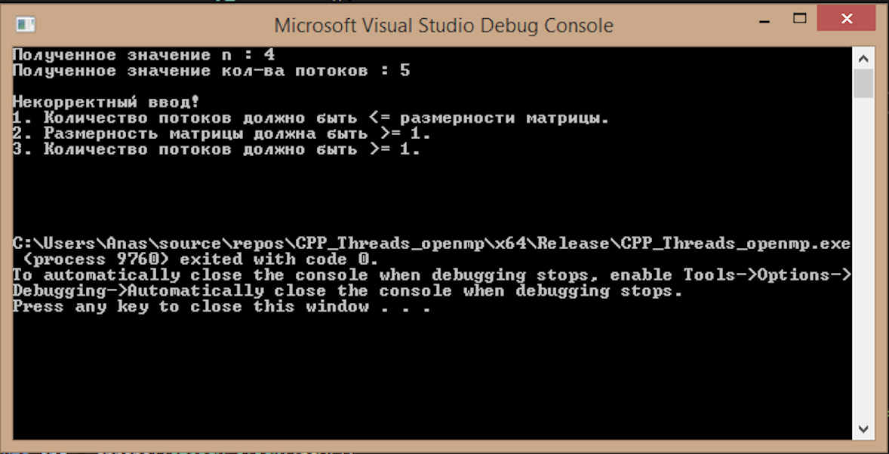
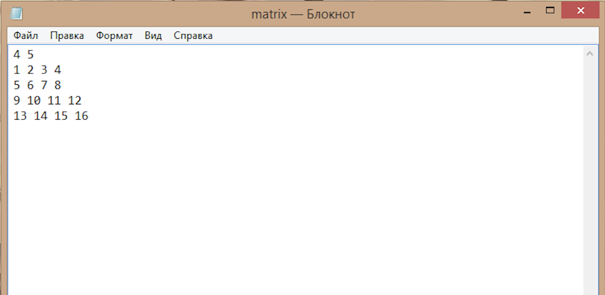
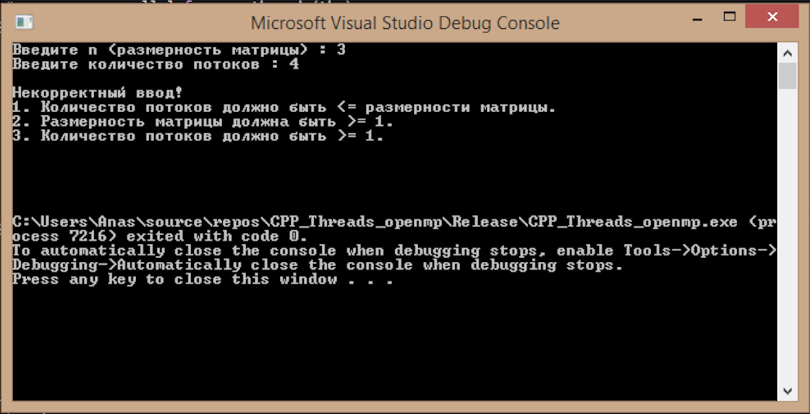
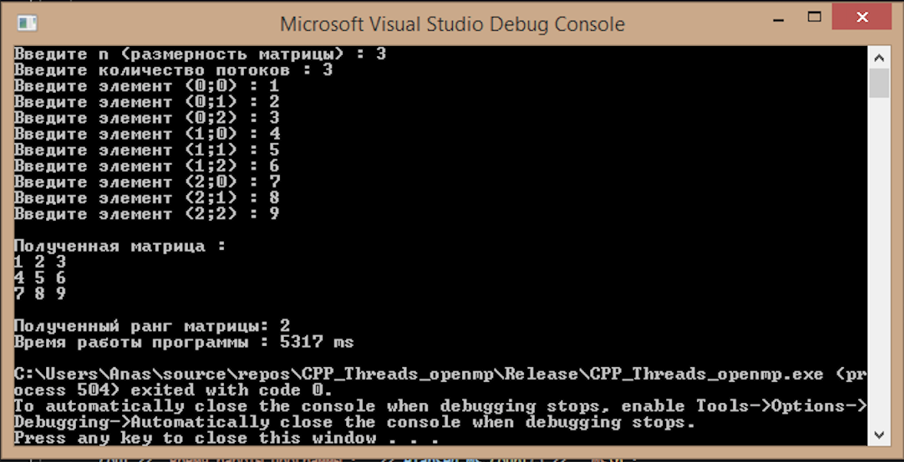
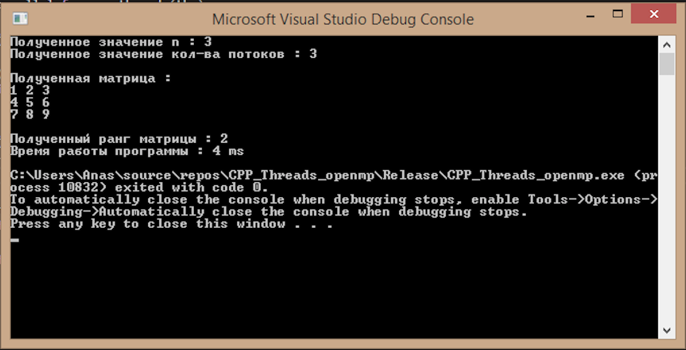
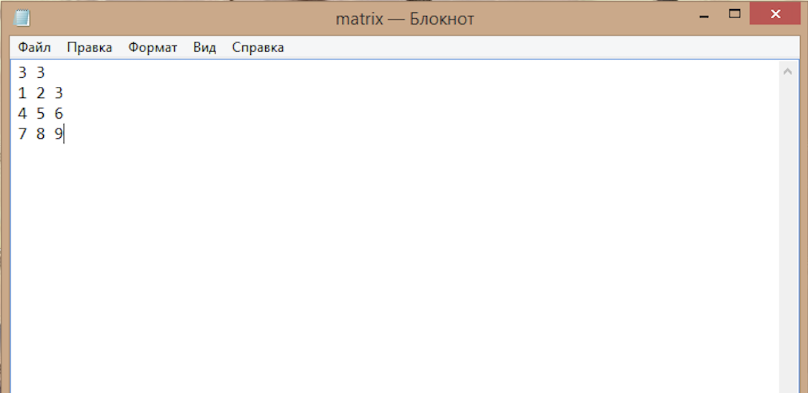

# openMP_cpp_HW
## Домашняя работа №5 по курсу "Архитектура вычислительных систем". НИУ ВШЭ, ПИ, 2 курс
#### В качестве источников информации выступили:
<!--ts-->
  * https://pro-prof.com/archives/4335  
  * https://habr.com/ru/company/intel/blog/85273/  
  * http://edu.mmcs.sfedu.ru/pluginfile.php/48306/mod_resource/content/1/OpenMP.pdf  
<!--te-->
### Работу выполнил студент группы БПИ191(1) Бен Мустафа Анаc
#### Пояснительная записка к проекту представлена [здесь](Materials/БенМустафа_191.pdf).
#### Код программы представлен [здесь](Code/main.cpp).
### Вариант 5. 
> Разработать программу с применением библиотеки OpenMP.
>
> Определить ранг матрицы. Входные данные: целое положительное число n, произвольная матрица А размерности n х n. Количество потоков является входным параметром, при этом размерность матриц может быть не кратна количеству потоков.
>
## Результаты работы программы
Правильность выполнения работы была проверена на нескольких тестах, ниже будут представлены некоторые из них.
## Тесты 1 - 2 (некорректные данные)
По логике вещей, количество потоков, переданных программе пользователем, должно быть меньше или равно размерности матрицы. В программе для этого организована проверка.
- **Введём размерность матрицы = 4, кол-во потоков = 5. Программа не отрабатывает, выписывая соответствующее предупреждение.** 
   
   
- **Введём размерность матрицы = 3, кол-во потоков = 4 (теперь уже ручным вводом). Программа не отрабатывает, выписывая соответствующее предупреждение.** 
   
## Тест 3 - 4 (корректные данные)
-**Ручной ввод параметров и матрицы.**
   
-**Считывание параметров и матрицы из файла.**
   
   
